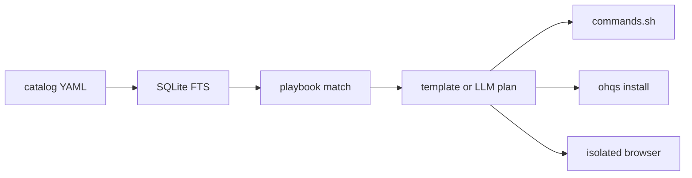

# OpenHat Quick Start (`ohqs`)

OpenHat workstation catalog and **`ohqs`**: search tools, guides, extensions, and bounty platforms, then get a step-by-step playbook for **authorized** pentests and bug bounties.

`ohqs` is not an exploit generator. It plans detection, triage, and reporting. You must state written authorization and scope before it will build a plan.

The company is OpenHat. The binary is `ohqs`. First-party code lives in [`ohqs/`](ohqs/). Catalog YAML stays in [`catalog/`](catalog/). Upstream checkouts live in [`third-party-resources/`](third-party-resources/).

## Quick start

```bash
git clone <this-repo> && cd quick-start   # catalog + ohqs only — do not use --recurse-submodules
make                                      # build, install ohqs on PATH, index, open the UI
```

Open **http://127.0.0.1:8787**, type a situation + scope, tick the authorization checkbox, then **Build playbook**. From the plan you can download `commands.sh`, install missing tools, run commands, and open the isolated test browser.

Prefer the terminal?

```bash
./bin/ohqs search nuclei                                 # what should I use/read for this?
./bin/ohqs recommend --authorized --scope "..." --situation "..." [--llm]
./bin/ohqs show gitleaks
```

## How it works

YAML records are the source of truth. `ohqs index` builds a local SQLite FTS index; `ohqs index --semantic` persists vector embeddings for semantic reranking, and `ohqs index download` fetches that vectorized index from the release so you skip local embedding. Given a situation, `ohqs` matches a playbook, retrieves relevant catalog tools (semantically reranked when vectors exist), and (optionally) asks an OpenAI-compatible model to draft the plan. You can export `commands.sh` / `FINDINGS.md`, install missing tools, and open an isolated test browser.



Worked examples: [EXAMPLES.md](EXAMPLES.md). How to add records: [CONTRIBUTING.md](CONTRIBUTING.md).

## Clone and submodules

A default clone is **catalog + `ohqs` only**. The 58 upstream trees under `third-party-resources/` are git submodules and are **not** downloaded unless you ask. Do not use `--recurse-submodules` — that pulls Metasploit, Wireshark, SecLists, and everything else.

```bash
git clone <this-repo>            # catalog + ohqs only — do not use --recurse-submodules
make submodules                  # optional: shallow-fetch everything
./bin/ohqs submodules            # same
./bin/ohqs submodules gitleaks   # one catalog id
```

`ohqs install` for a playbook fetches only the tools that plan needs. See [third-party-resources/README.md](third-party-resources/README.md).

## Browser UI

One command from the repo root:

```bash
make                 # build, put ohqs on PATH, index, open the UI
make stop
make help
make test
```

`./scripts/ohqs.sh` is the same flow if you prefer a shell script.

The UI listens on **http://127.0.0.1:8787**.

| Action | What it does |
| --- | --- |
| Build playbook | Requires situation, written scope, and the authorization checkbox |
| Draft the plan with your model | Bring your own OpenAI-compatible endpoint + API key; saved locally (see [Local models](#local-models)) |
| Download commands.sh | Exports the current plan as a reviewed script |
| Install missing tools | Background job; survives a tab or server restart |
| Run commands | Runs a reviewed `commands.sh` as a durable job |
| Open test browser | Isolated Firefox/Waterfox/Chrome with extensions pre-installed |

JSON API on the same process: `GET /healthz`, `GET /v1/search?q=`, `GET /v1/index`, `POST /v1/index/rebuild`, `POST /v1/index/download`, `GET /v1/tools/{id}`, `GET /v1/models`, `POST /v1/recommend`, `POST /v1/deps`, `GET /v1/history`.

## CLI

Build first (`make build` or `make start`). Then:

```bash
./bin/ohqs serve
```

Same UI and API as `make start`.

```bash
./bin/ohqs index
./bin/ohqs search nuclei
./bin/ohqs show gitleaks
./bin/ohqs recommend \
  --authorized \
  --scope "HackerOne program example.com, in-scope www and api" \
  --situation "vibe-coded Next.js SaaS with auth and a chat feature" \
  --target https://app.example.com \
  --path ./client-repo \
  --export ./ohqs-out/client
./bin/ohqs recommend --authorized --scope "..." --situation "..." --llm
./bin/ohqs deps --authorized --scope "..." --situation "..."
./bin/ohqs install --authorized --scope "..." --situation "..."
./bin/ohqs browser
./bin/ohqs run ./ohqs-out/client/commands.sh
./bin/ohqs setup
./bin/ohqs configure
./bin/ohqs install-cli
./bin/ohqs submodules            # optional: fetch all third-party trees
./bin/ohqs submodules gitleaks   # or just one catalog id
```

| Command | Purpose |
| --- | --- |
| `serve` | HTML UI + JSON API on `127.0.0.1:8787` |
| `search <query>` | Catalog search — lexical FTS + tags by default, vector rerank when vectors exist (see `--semantic`/`--no-semantic`) |
| `show <id>` | One catalog record as JSON |
| `recommend` | Build a playbook (requires `--authorized` and `--scope`) |
| `recommend --llm` | Same gates; draft the plan via an OpenAI-compatible model |
| `index` | Rebuild `data/ohqs.sqlite` (lexical) |
| `index --semantic` | Same, plus persist vector embeddings (needs Ollama `nomic-embed-text` or `HF_TOKEN`) |
| `index download` | Fetch the prebuilt, already-vectorized index from the project release |
| `models list` | Recommended local GGUF models with a GPU/RAM fit check |
| `models install <id>` | Unsloth-managed install: venv + GGUF weights (checked against your GPU/RAM) |
| `models serve <id>` | Run the installed GGUF as a local OpenAI-compatible endpoint |
| `deps` | Host OS + which plan tools are already installed |
| `install` | Clone/build missing tools for the matched playbook |
| `install-cli` | Copy `ohqs` onto PATH |
| `submodules` | Opt-in shallow fetch of third-party trees (all, or catalog ids) |
| `browser` | Isolated test browser with extensions |
| `run` | Execute a reviewed `commands.sh` |
| `setup` | Kali / Exegol / BlackArch notes |
| `configure` | Show resolved paths, toolchain, and LLM endpoint (key not printed) |
| `configure --save --openai-*` | Persist your endpoint/key/model to `data/config.json` (local, gitignored) |

Recommend Kali Linux, Exegol (macOS/Docker), or a BlackArch overlay. See [third-party-resources/os/README.md](third-party-resources/os/README.md).

## Local models (bring your own key)

Plans are drafted by **your** model. Bring your own API key and OpenAI-compatible endpoint — nothing leaves your machine. Hosted APIs often refuse security-research **planning** prompts, so we recommend serving an open-weight model with **[Unsloth](https://github.com/openhat/unsloth)** (placeholder — companion repo). Any OpenAI-compatible server also works: OpenAI, vLLM, llama.cpp, LM Studio, Cursor, etc.

Save your config once (stored locally in `data/config.json`, which is gitignored — the key never leaves your machine). For a single-model server (Unsloth/vLLM/llama.cpp) it's just base URL + API key — the model name is optional:

```bash
./bin/ohqs configure --save \
  --openai-base-url http://127.0.0.1:8000/v1 \
  --openai-api-key  sk-local
./bin/ohqs recommend --authorized --scope "..." --situation "..." --llm
```

Add `--openai-model <name>` when your endpoint serves multiple models or requires a specific served name (vLLM, or the hosted OpenAI API — which defaults to `gpt-4o-mini`). When the model is blank, `ohqs` omits it from the request so single-model servers use whatever they have loaded.

In the **browser UI**, tick "Draft the plan with your model" and enter the base URL and API key (model optional). The key is saved locally on submit; the Install / Run / Export / Browser buttons reuse it without re-entering, and it is never rendered back into the page or written to history.

Precedence for each field: `--openai-*` flag (or UI field) > `data/config.json` > `OHQS_OPENAI_*` / `OPENAI_API_KEY` env > default. So env vars still work if you prefer them:

```bash
export OHQS_OPENAI_BASE_URL=http://127.0.0.1:8000/v1
export OHQS_OPENAI_API_KEY=sk-local
export OHQS_OPENAI_MODEL=your-model
```

Until the Unsloth companion repo exists, see [docs/UNSLOTH-REPO-PLAN.md](docs/UNSLOTH-REPO-PLAN.md) for Unsloth + Runpod setup. The model is asked for an authorized engagement plan (detection, triage, reporting), not exploit payloads. If the model response cannot be parsed, `ohqs` falls back to the template playbook.

### Managed local models (fit-aware)

`ohqs recommend` and `ohqs models list` recommend GGUF models that fit your GPU/RAM, including the project-tested security personas:

```bash
./bin/ohqs models list                       # fit check + which model fits your hardware
./bin/ohqs models install <id>               # Unsloth-managed: venv + GGUF download (refuses if it does not fit; --force to bypass)
./bin/ohqs models serve <id>                 # OpenAI-compatible endpoint on 127.0.0.1:8001/v1
./bin/ohqs configure --save \
  --openai-base-url http://127.0.0.1:8001/v1 \
  --openai-api-key sk-local --openai-model <id>
```

Featured personas (also listed under `## Local LLM fit` at the end of every `ohqs recommend`):

- `ravenx` — `deadbydawn101/RavenX-CyberAgent-Qwen3.6-35B-A3B-...GGUF`, 35B-A3B MoE, ~24 GB VRAM class.
- `defiant-fable` — `DavidAU/Qwen3.5-9B-The-Defiant-Fable-...GGUF`, 9B, ~8 GB VRAM class.

Both are agents/personas made for pentest triage and bug-hunt workflows; the rest of the catalog (Qwen3 instruct / Coder) are solid general fallbacks. You are responsible for checking each model's license before use.

## License

First-party `ohqs` code, catalog YAML, scripts, and docs are **MIT**. Anyone may use, copy, modify, and distribute them **without warranty**. See [LICENSE](LICENSE).

Upstream tools, guides, and extensions under `third-party-resources/` keep **their own licenses**. This repo does not relicense Metasploit, Wireshark, SecLists, or any other checkout. See [NOTICE](NOTICE) and each project's `LICENSE`.

## Layout

- [`ohqs/`](ohqs/) — Go module (`cmd/ohqs`, `internal/`)
- [`catalog/`](catalog/) — YAML source of truth
- [`REFERENCES.md`](REFERENCES.md) — the catalog inventory: tools, guides, extensions, platforms (each links to its upstream)
- [`third-party-resources/`](third-party-resources/) — git submodules ([index](third-party-resources/README.md)); **not cloned by default**
- [`.gitmodules`](.gitmodules) — upstream URLs and pinned commits
- [`docs/UNSLOTH-REPO-PLAN.md`](docs/UNSLOTH-REPO-PLAN.md) — temporary companion-repo plan

See [Clone and submodules](#clone-and-submodules) above. `.gitmodules` sets `shallow = true`.

---

## Catalog

Everything `ohqs` knows about — browser extensions, tools, guides and cheat sheets, reference docs, operating systems, bug bounty platforms, and external scan indexes — is inventoried in **[REFERENCES.md](REFERENCES.md)**, each linked to its upstream home.

Records are YAML in [`catalog/`](catalog/); upstream checkouts live under [`third-party-resources/`](third-party-resources/).

**Use the catalog from the CLI**: `ohqs search <query>` (or the browser UI search box) answers "what should I use / read for this?", and `ohqs recommend` picks the matching playbook, tools, and steps.
